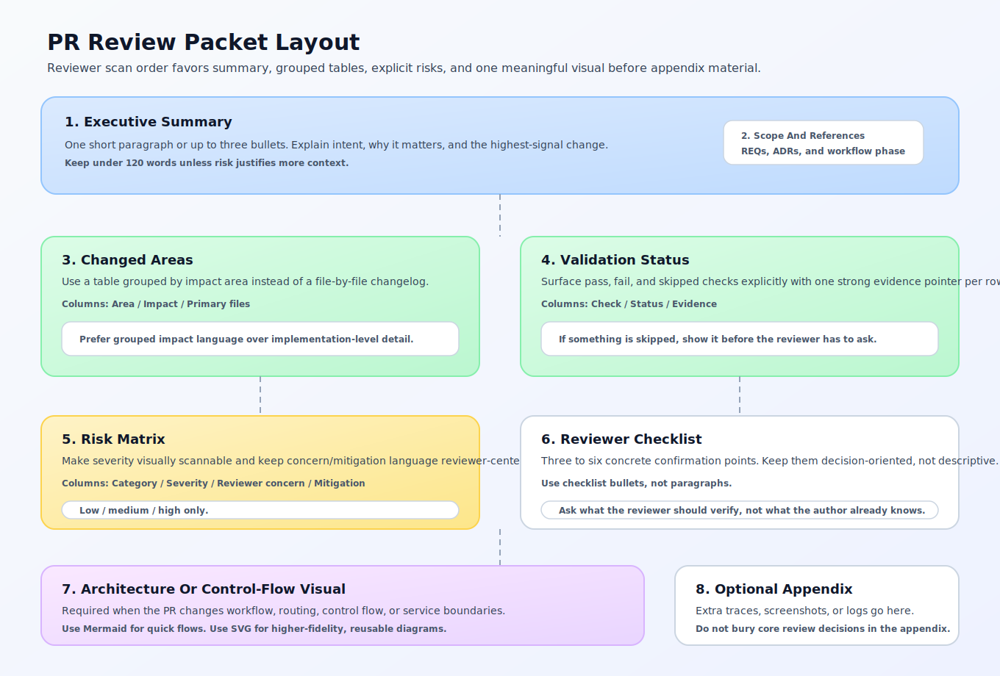

# PR Review Packet Example

This is a reviewer-facing example packet for the `REQ-018` contract baseline.

It is an example layout, not a literal generated runtime artifact.

## Executive Summary

This PR stabilizes the shared PR packet contract so later workflow automation can generate one predictable review artifact instead of ad hoc summaries. It adds canonical artifact paths, an example fixture, and a lightweight CI check that verifies packet completeness rules before `REQ-020` introduces merge gating.

## Scope And References

- Requirements: `REQ-018`
- ADRs:
  - `0003-structured-io-and-constrained-generation`
  - `0004-phase-based-orchestration-over-pure-react`
- Workflow phase: `pr_packet_and_handoff`

## Changed Areas

| Area | Impact | Primary files |
| --- | --- | --- |
| Shared packet contract | Formalizes packet identifiers, reference formats, and artifact-path conventions. | `packages/py/shared-schemas/pr-review-packet.schema.yaml`, `packages/py/shared-schemas/pr-review-packet-contract.md` |
| Example baseline | Anchors the minimum complete packet shape for later generators. | `packages/py/shared-schemas/examples/pr-review-packet.example.json` |
| Contract validation | Adds a stdlib-only CI check for the packet contract and fixture. | `scripts/check-pr-review-packet-contract.py`, `.github/workflows/shared-schema-contract.yml` |

## Validation Status

| Check | Status | Evidence |
| --- | --- | --- |
| Contract fixture validation | passed | `python3 scripts/check-pr-review-packet-contract.py` |
| Requirement calibration | passed | `bash scripts/check-requirements.sh` |
| Progressive disclosure calibration | passed | `bash scripts/check-progressive-disclosure.sh` |

## Risk Matrix

| Category | Severity | Reviewer concern | Mitigation |
| --- | --- | --- | --- |
| Schema drift | medium | Future generators might extend the packet differently before visual guidance and workflow gating land. | Keep the contract additive and update the fixture in the same PR. |
| Reviewer layout drift | low | Different packet generators might invent different human-facing section orders. | `REQ-019` defines a standard section order, table conventions, and visual rules. |

## Reviewer Checklist

- Confirm the packet contract keeps reviewer prose separate from typed machine-consumed sections.
- Confirm packet artifact paths stay under `artifacts/pr-review-packets/pr-<number>/`.
- Confirm linked `REQ` and ADR values use canonical identifier formats.
- Confirm the validation evidence is sufficient without opening every changed file.

## Architecture Or Control-Flow Visual

The packet layout reference above shows the intended reviewer scan order from summary to decision checklist.

## Optional Appendix

- Example contract fixture: `packages/py/shared-schemas/examples/pr-review-packet.example.json`
- Layout guidance: `docs/architecture/patterns/pr-review-packet-visual-language.md`
